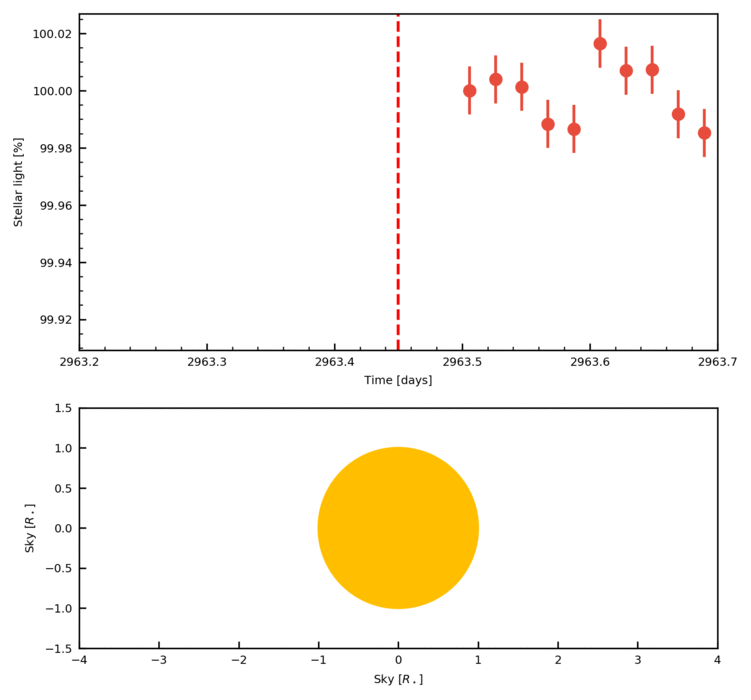

# __TANGO__
## Transit ANimation for General Orbits
#### Written by Oscar Barragán
##### email: oscaribv@gmail.com
##### Updated October 25, 2018


## __Introduction__

A clear night gives us an instantaneous snapshot of the Universe. At first sight celestial bodies seem immutable. Their apparent immutability disappears if we add an important ingredient: *time*.
The variability of their light – the so-called light curve – carries a wealth of precious information about the physical phenomena happening in faraway astronomical bodies.

Planets perform a gravitational *TANGO* around their parent stars which is called orbit.
If the orbit inclination is close to 90°, the presence of a planet orbiting its host star can be inferred by detecting the periodic drops of stellar flux caused by the planet partly occulting the stellar disk. This phenomenon is called __transit__.


## Dependencies

* numpy
* matplotlib
* seaborn (optional)
* [pyaneti](https://github.com/oscaribv/pyaneti) (optional, needed if you want to plot the models)


## Animate *K2* data of GJ 9827

The system GJ 9827 contains (at least) three transiting planets. They were discovered by *K2* on its Campaign 12 ( see [Niraula et al., 2017](http://iopscience.iop.org/article/10.3847/1538-3881/aa957c/meta), [Prieto-Arranz et al., 2018](https://www.aanda.org/articles/aa/abs/2018/10/aa32872-18/aa32872-18.html), and [Rodriguez et al., 2017](http://iopscience.iop.org/article/10.3847/1538-3881/aaa292/meta) for more details).
The brightness of this star combined with the exquisite photometry of *Kepler*, give us a marvelous light curve where the three transiting planets are visible. During February 12, 2017, planets b, c and d transited the star consecutively, and this was observed by *Kepler*. __We will animate this now!__

First, just clone TANGO.

```
git clone https://github.com/oscaribv/tango
```

The next step is to enter the tango directory and see what we can find inside it

```
cd tango
ls
  gj9827  README.md  tango.py
```

You can see that there is a directory called gj9827. This directory contains the light curve and input file needed to create your animation. The file lc_gj9827.dat contains *K2* long cadence data collected between 2963.5 and 2964.3 (BJD - 2454833) days. In this window there are three consecutive transits of GJ 9827 b, c and d (I used the light curve provided by EVEREST to create this file).

So now we have the light curve that we want to animate. The next step is to create the input file which will be used to pass the orbit solutions to the code. If you open the input file you will see something like This

```py
#Input file for tango
#system: GJ 9827
#Created by O. Barragan, October 2018.

#Data file with the flattened light curve
lcname = 'lc_gj9827.dat'

#--------------------------------------------------------------------
#                 Planet and orbit parameters
# Each parameter is a list in which each element
# correspond to a planet. For this case, there are three
# planets. But you can create animations with 1, 2, 3, and more planets.
#--------------------------------------------------------------------

#This file was creating using the values reported in Prieto-Arranz et al., (2018)
#Orbital period (days)
P =[1.2089662,3.6482269,6.2014190]
#time of mid-transit (days) Be sure that you are using the same units that in your data file
T0 = [2905.8264631,2905.5496113,2907.9619764]
#Orbit eccentricity
e = [0.,0.,0.]
#Angle of periastron
w = [0.,0.,0.]
#Scaled semi-major axis
a = [7.229235,15.096,21.5019118]
#orbit inclination (degrees)
inclination = [88.330714*np.pi/180,89.06*np.pi/180,87.702*np.pi/180]
#Scaled planet radius (Rp/R*)
rp = [0.0232259,0.0181983,0.0299279]
#Limb darkening coefficients following a quadratic law
u1 =  0.58
u2 =  0.15
#Next two variables are used to control the cadence of the light curve data
#Integration time of the data
t_cad = 30./60./24.
#Number of steps to integrate the data
n_cad = 10
#These values are useful now to integrate Kepler long cadence data

#--------------------------------------------------------------------
#              Animation controls
#--------------------------------------------------------------------
#Window size to show the data (days)
size_time = 0.5
#1./(photograms per day) in this case the code will create a photogram each 7.2 min
vel_time  = 1./200.
#Animation minimum time (Be sure that you are using the same units as in your data file)
tmin =  2963.2
#Animation maximum time (Be sure that you are using the same units as in your data file)
tmax =  2964.4

#--------------------------------------------------------------------
#                     Plot controls
#--------------------------------------------------------------------

#Control if we overplot the light curve model
#You need to have installed pyaneti in your computer to use it
is_plot_model = False

#-----------------------------------------------------------------
#                         END
#-----------------------------------------------------------------
```

Now that we have our input file ready, it is time to run TANGO to create our first animation.
Just type (the process takes some time)

```
$ python tango.py gj9827
  Creating png files
  png files have been created
  Creating animation
  Your animation is ready at gj9827/gj9827.gif
```

If you see something like this appearing in your terminal, now you have created your animation of GJ 9827. Open the file gj9827/gj9827.gif and you will see this

<p align="center">
  
</p>

What is this? The upper panel of the animation shows the *K2* photometric time-series. Each point represent the integrated flux received at the *Kepler* detector at different times.
There are some clear flux drops, which we know are caused by transiting planets. The lower panel shows the reconstructed planets' paths in the sky. The position of the planets represent the data acquired at the time marked with a vertical dashed line in the upper panel. We can see how the three planets cross the stellar disk one after the other causing a whimsical flux variation.

## Animate *K2* data and model of GJ 9827

Now that we have learned how to create an animation with TANGO, maybe we wan to to over-plot the inferred light curve model to to show how our parameters can explain the observations. This can be easily done by changing only one line in the input file for GJ 9827.

TANGO uses the code *pyaneti* to create the model that will be over-plotted on the animation. This tutorial assumes that you do not have *pyaneti* installed in your computer. So, first clone *pyaneti* in your home directory

```
cd
git clone https://github.com/oscaribv/pyaneti
```

The next step is to compile *pyaneti* (for details about dependencies click [here](https://github.com/oscaribv/pyaneti))

```
cd pyaneti
make
```

If you have all the dependencies installed, the compilation should end without error. Now the next step is to add *pyaneti* to your PYTHON path. I am using a Linux computer, so this is done in the `.bashrc` file (this can vary for other operating systems). Copy the next line in your `.bashrc` or equivalent file

```
export PYTHONPATH=$PYTHONPATH:/home/oscar/pyaneti
```


**If you have any comments, requests, suggestions or just need any help, please don't think twice, just contact us!**

##

#### Warning: This code is under developement and it may contain bugs. If you find something please contact me at oscaribv@gmail.com
